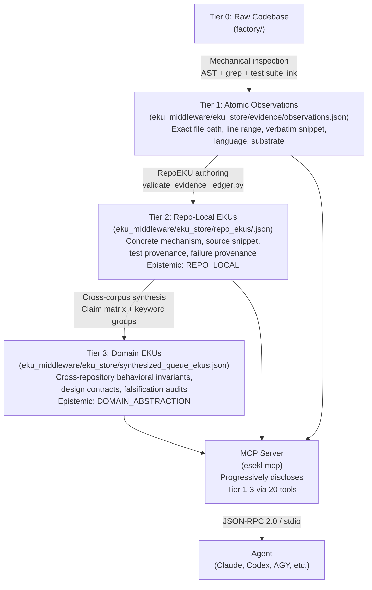

# ESEKL — Empirical Software Engineering Knowledge Layer

ESEKL turns production-grade open-source systems research into a set of structured, agent-usable tools. It ships as a Model Context Protocol (MCP) server. That is the only supported delivery mechanism.

Agents working on distributed systems — queue processors, brokers, streaming pipelines — routinely hallucinate behavioral invariants, misquote production failure modes, and generate verification plans with no empirical grounding. ESEKL eliminates that gap. It provides provenance-traced, evidence-labeled knowledge drawn from mechanical inspection of mature open-source systems, exposed through task-shaped MCP tools that enforce progressive disclosure instead of raw context dumping.

The current corpus covers queue, broker, and streaming systems: asynq, bullmq, pgmq, river, goqite, litequeue, nats-server, nsq, blazingmq, redpanda, rabbitmq, artemis, and rocketmq.

---

## How It Helps Agents

Without ESEKL, a coding or planning agent working on job queues must either hallucinate behavioral contracts or browse thousands of lines of raw source to extract patterns. Both paths fail: hallucination produces incorrect invariants; raw file browsing saturates the context window before the agent reaches the relevant evidence.

ESEKL provides:

- **Behavioral invariants** distilled from direct source inspection across the full corpus, each labeled with how it was derived (`SOURCE_OBSERVED`, `TEST_OBSERVED`, `HISTORY_SUPPORTED`).
- **Failure mode chains** from real production bugs and regression commits, traceable to the exact commit hash and test function that closed them.
- **Implementation packets** — concrete SQL queries, Lua scripts, and Go/TypeScript snippets extracted from production files — served with substrate and mechanism filters so the agent gets exactly the class of implementation it is building toward.
- **Design critique** against cross-corpus invariants, surfacing missing fencing guarantees, clock-drift risks, and poison-job isolation gaps in the agent's proposed architecture.
- **Adversarial verification plans** generated from empirical failure evidence, ready to drive a test suite.

Every result carries an epistemic label. Agents never confuse a cross-repo abstraction with a model inference.

---

## Architecture: How EKUs Are Developed



The factory directory holds commit-pinned checkouts of the source repositories. Inspection is mechanical: source file paths, line ranges, verbatim code snippets, and test function names are captured as Atomic Observations. Those observations are grouped into Repo-Local EKUs — concrete, evidence-bearing records tied to a single repository — then synthesized upward into Domain EKUs that carry cross-corpus behavioral invariants with explicit falsification audits. The MCP server reads the static store and serves it through progressive disclosure tools. Agents interact only through those tools; they never touch the raw store.

The knowledge store (`eku_store/`) ships **bundled inside the npm package**. No initialization step is required. Add the MCP config once and every machine that can run `npx` has the full corpus immediately.

---

## Installation

No installation step is required.

The `eku_store/` directory is bundled directly inside the `esekl` npm package. When `npx --package=@esekl/mcp esekl mcp` starts, the server resolves the store from the package directory — no local copy, no `init`, no per-project setup.

Wire the MCP server into your agent host using one of the configs below.

---

## MCP Configuration

This single JSON block works on every machine, for every project, with no paths and no prior setup:

```json
{
  "mcpServers": {
    "esekl": {
      "command": "npx",
      "args": ["--yes", "--package=@esekl/mcp", "esekl", "mcp"]
    }
  }
}
```

**Store resolution order** (first match wins):

1. `--store-root=<path>` — explicit override, for advanced use.
2. `~/.esekl/store` — if `esekl init` was run for a fully offline or custom corpus.
3. `<package_dir>/eku_store` — **bundled in the package, always available, no setup needed.**

### Claude Desktop

Edit `~/.config/claude/claude_desktop_config.json` (macOS: `~/Library/Application Support/Claude/claude_desktop_config.json`) and add the block above. Restart Claude Desktop.

### AGY (Antigravity)

Add the block above to your AGY MCP config file. No restart required for most AGY configurations.

### Codex CLI

Add to `~/.codex/config.toml`:

```toml
[mcp_servers.esekl]
command = "npx"
args = ["--yes", "--package=@esekl/mcp", "esekl", "mcp"]
```

For Codex environments that accept JSON `mcpServers` config, use the JSON block above.

---

## Tool Surface

The MCP server exposes 20 tools across three tiers.

### Discovery and Navigation (6 tools)

| Tool | Required Args | Purpose |
|---|---|---|
| `get_capabilities` | none | Corpus metadata: domain, total EKUs, repositories, coverage ratios. |
| `list_dossiers` | none | Paginated repository dossier listing with language and storage engine filters. |
| `get_dossier_summary` | `repo` | Compact summary of key mechanisms and edge conditions for one repository. |
| `list_research_threads` | none | Cross-repository failure themes with linked domain EKU IDs. |
| `get_dossier_slice` | `repo`, `sliceType` | Structured slice of a dossier: `architecture`, `state_machine`, `lease_management`, `failure_recovery`, or `concurrency_control`. |
| `compare_engines` | `repoA`, `repoB` | Side-by-side comparison of two engines across mechanisms, invariants, and storage substrate. |

### Evidence and Layered Retrieval (12 tools)

| Tool | Required Args | Purpose |
|---|---|---|
| `search_evidence` | `query` | Multi-factor search across EKUs, claims, observations, and failures. Supports `layer` filter. |
| `get_eku` | `ekuId` | Full domain EKU: behavioral invariant, design contract, verification contract, corpus stats. |
| `list_repo_ekus` | none | Paginated list of Repo-Local EKUs with mechanism and object type filters. |
| `get_repo_eku` | `repoEkuId` | Full Repo-Local EKU with exact source lines, SQL/Lua snippet, and test suite provenance. |
| `list_keyword_groups` | none | Cross-cutting keyword and substrate facet groups aggregating Repo-Local EKUs. |
| `get_keyword_group` | `groupId` | Full keyword group with participating RepoEKUs and linked Domain EKUs. |
| `trace_domain_eku` | `ekuId` | Down-traces a Domain EKU to its supporting Repo-Local EKUs, keyword groups, and raw observations. |
| `get_failure_patterns` | `problemStatement` | Second-order failure patterns and vulnerability signatures relevant to a problem description. |
| `get_failure_chains` | none | Causal failure chains: trigger, invariant breakdown, terminal failure, regression test status. |
| `get_implementation_evidence` | none | Dynamic implementation packets derived from Repo-Local EKUs, filtered by substrate and mechanism. |
| `explain_provenance` | `evidenceId` | Down-traces any ID to exact file path, line range, commit hash, snippet SHA-256, and test function. |
| `get_data_quality_report` | none | Diagnostic audit across Repo-Local and Domain EKUs surfacing missing fields and broken references. |

### Design Critique and Verification (2 tools)

| Tool | Required Args | Purpose |
|---|---|---|
| `compare_design_against_evidence` | `proposedDesign` | Critiques a proposed architecture against empirical invariants, returning matched EKUs, missing guarantees, and "what not to promise" contracts. |
| `generate_verification_plan` | `requirementOrDesign` | Generates adversarial test suites mapped directly to empirical evidence and historical failures. |

---

## Result Shapes

### `get_eku`

```json
{
  "id": "EKU-QUEUE-015",
  "title": "Fenced Domain Result Promotion & Outbox Emission",
  "objectType": "BEHAVIORAL_INVARIANT",
  "claimId": "CLM-015",
  "problem": "A queue can fence stale completion of the job row while still allowing a superseded worker to write authoritative domain results or emit an outbox event.",
  "behavioralInvariant": "Ownership fencing must guard every authoritative side-effecting state mutation, including domain result promotion or outbox emission, not only queue-row completion.",
  "designContract": "Before committing a result row, payment ledger projection, or sendable outbox record, the storage transaction must prove current job ownership by token/generation.",
  "verificationContract": [
    "Worker A owns generation 1 and pauses.",
    "Worker B owns generation 2 and completes.",
    "Worker A attempts domain result promotion and queue completion.",
    "Both stale writes affect zero authoritative rows and emit stale-owner telemetry."
  ],
  "supportingEvidence": ["OBS-BULLMQ-002", "OBS-LITEQUEUE-002"],
  "historicalEvidence": ["HIST-RIVER-003"],
  "corpusStats": {
    "corpusSize": 13,
    "applicable": 7,
    "supports": 2,
    "counterexamples": 3
  }
}
```

### `get_repo_eku`

```json
{
  "repoEku": {
    "id": "REKU-RIVER-001",
    "repository": "river",
    "mechanism": "Relational Lock-Free Dequeue (FOR UPDATE SKIP LOCKED)",
    "claim": "PostgreSQL FOR UPDATE SKIP LOCKED allows concurrent worker pools to acquire non-overlapping available jobs without table-level locking.",
    "localContext": "River implements its primary job queue inside PostgreSQL. It relies on FOR UPDATE SKIP LOCKED in its sqlc query to scale Go worker goroutines.",
    "sourceProvenance": {
      "filePath": "riverdriver/riverpgxv5/internal/dbsqlc/river_job.sql",
      "lineRange": [45, 55],
      "queryOrCodeSnippet": "SELECT id, args, attempt, state FROM river_job WHERE state = 'available' ORDER BY priority ASC, scheduled_at ASC LIMIT $1 FOR UPDATE SKIP LOCKED;"
    },
    "testProvenance": {
      "filePath": "internal/jobexecutor/job_executor_test.go",
      "testName": "TestJobExecutor"
    },
    "epistemicStatus": "REPO_LOCAL"
  }
}
```

### `explain_provenance`

```json
{
  "evidenceId": "OBS-BULLMQ-002",
  "type": "OBSERVATION",
  "repository": "taskforcesh/bullmq",
  "commitHash": "c06b51cd3aacd0d9ee65e2544220c89f24d2479c",
  "filePath": "src/commands/moveToFinished-12.lua",
  "lineRange": { "start": 40, "end": 44 },
  "sourceUrl": "https://github.com/taskforcesh/bullmq/blob/c06b51cd3aacd0d9ee65e2544220c89f24d2479c/src/commands/moveToFinished-12.lua#L40-L44",
  "snippetSha256": "4b68e98da6984e1b00ad99e74d1c448bb5bbcb110cb16246473133604f32616f",
  "epistemicStatus": "SOURCE_OBSERVED"
}
```

### `compare_design_against_evidence`

```json
{
  "matchingEkus": ["EKU-QUEUE-015", "EKU-QUEUE-016", "EKU-QUEUE-017"],
  "missingInvariants": [
    {
      "invariant": "Storage-Time Lease Evaluation",
      "severity": "CRITICAL",
      "risk": "Caller-supplied VM timestamps allow clock drift across container hosts to cause premature lease expiration or duplicate execution.",
      "recommendedFix": "Use database server time (e.g. clock_timestamp()) exclusively in lease recovery queries."
    }
  ],
  "whatNotToPromise": [
    "Never promise true exactly-once delivery over external network boundaries without partner idempotency keys.",
    "Never promise constant latency during unmetered enterprise batch spikes; enforce admission semaphores and HTTP 429/503."
  ],
  "epistemicClassification": {
    "empiricalEvidenceCount": 8,
    "modelInferredPoints": 2
  }
}
```

---

## Repository Layout

```
eku_middleware/          npm package root (published as esekl)
  bin/                   CLI and MCP server entry points
  src/                   MCP server implementation
  eku_store/             Static knowledge store — ships bundled inside the package
    evidence/            Atomic observations and historical failure records
    repo_ekus/           Repo-Local EKUs per repository
    synthesized_queue_ekus.json   Cross-corpus Domain EKUs
    claim_matrix.json             Claim-to-corpus coverage matrix
    schema/              JSON schema and specification for RepoEKUs
    release/             factory_repo_lock.json — commit-pinned source provenance
  mcp_contract.md        Full JSON-RPC contract with input/output schemas

analyzer/                Validation scripts (not shipped in npm package)
factory/                 Local raw repository cache for research rounds (git-ignored)
```

---

## Roadmap: Domain Expansion

The current package (`@esekl/mcp`) bundles the queue and broker corpus. As new domains are researched, the corpus splits into independently versioned scoped packages under the `@esekl/` org:

```
@esekl/mcp               Core MCP server — always installed, always the entry point
@esekl/store-queues      Queue and broker corpus (asynq, bullmq, pgmq, river, nats, ...)  ← current
@esekl/store-databases   Database internals corpus (postgres, sqlite, redis internals, ...)
@esekl/store-networking  Networking and protocol corpus (gRPC, HTTP/2, QUIC, ...)
@esekl/store-all         Meta-package: installs all domain stores
```

**MCP config never changes.** The single JSON block works regardless of which domain stores are installed:

```json
{
  "mcpServers": {
    "esekl": {
      "command": "npx",
      "args": ["--yes", "--package=@esekl/mcp", "esekl", "mcp"]
    }
  }
}
```

**Opting into a domain** (when additional stores ship):

```bash
npm install @esekl/store-databases
# MCP server discovers and loads it automatically on next start — no config change.
```

**Why scoped packages instead of a CLI-download model:**
The store is read-only versioned data, not source code you own. npm is the right distribution primitive: reproducible installs, per-domain changelogs, and automatic caching via `npx`. Domain updates ship as npm version bumps; the MCP server picks them up without any re-configuration.

---

## Epistemic Labels

All tool results carry explicit labels. Agents must not strip or ignore them.

| Label | Meaning |
|---|---|
| `SOURCE_OBSERVED` | Direct mechanical inspection of production source files and AST structures. |
| `TEST_OBSERVED` | Direct inspection of regression test suites in the target repository. |
| `HISTORY_SUPPORTED` | Verified real-world production incident, bugfix, or issue commit. |
| `DOCUMENTED` | Architecture documentation or official specification statement. |
| `MODEL_INFERRED` | High-level synthesis formulated across observations. |
| `CROSS_REPO_ABSTRACTION` | Universal behavioral property validated across two or more codebases. |
| `SYNTHESIZED_ADVICE` | Actionable architectural guidance derived from empirical invariants. |

---

## Telemetry

`@esekl/mcp` collects anonymous usage events via [PostHog](https://posthog.com) to understand which tools agents use and how the server is adopted across platforms. No personal data, no query content, no file paths are ever recorded.

### What is collected

| Event | When | Properties |
|---|---|---|
| `mcp_start` | Server process starts | `version`, `platform`, `node_version` |
| `tool_call` | Any of the 20 tools is invoked | `tool_name`, `status` (`ok` / `error`), `version`, `platform`, `node_version` |

`distinct_id` is always `anonymous` — no user ID, no machine ID, no persistent identifier of any kind.

### What is never collected

- Query text, proposed designs, or any argument values passed to tools
- Tool response content
- File paths or project structure
- IP addresses (PostHog anonymization is enabled)

### Opting out

Set `ESEKL_NO_TELEMETRY=1` in your environment. The server starts and operates identically — the only difference is no HTTP request is made to PostHog.

**Shell / global:**
```bash
export ESEKL_NO_TELEMETRY=1
```

**Per-session in your MCP config** (Claude Desktop / AGY):
```json
{
  "mcpServers": {
    "esekl": {
      "command": "npx",
      "args": ["--yes", "--package=@esekl/mcp", "esekl", "mcp"],
      "env": { "ESEKL_NO_TELEMETRY": "1" }
    }
  }
}
```

**Codex `config.toml`:**
```toml
[mcp_servers.esekl]
command = "npx"
args = ["--yes", "--package=@esekl/mcp", "esekl", "mcp"]
env = { ESEKL_NO_TELEMETRY = "1" }
```

---

## Full MCP Contract

Complete input and output schemas for all 20 tools: [`eku_middleware/mcp_contract.md`](./eku_middleware/mcp_contract.md)
