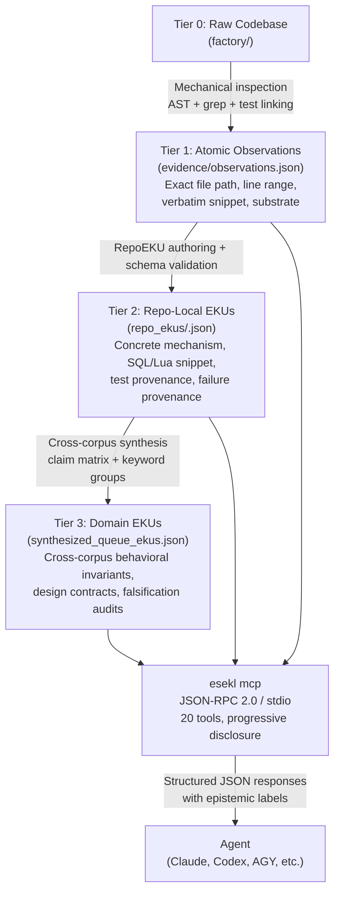

# esekl — ESEKL Model Context Protocol Server

ESEKL (Empirical Software Engineering Knowledge Layer) is an MCP server that gives agents access to provenance-traced empirical evidence from mature open-source distributed systems. It ships exclusively as an MCP server. There is no other supported interface.

Agents designing queue processors, brokers, or streaming pipelines tend to hallucinate behavioral invariants, misattribute failure modes, and produce verification plans without empirical grounding. ESEKL solves this by mechanically inspecting production codebases — extracting SQL queries, Lua scripts, test suites, and regression commits — and serving that material through 20 progressive-disclosure tools that prevent context flooding.

The current corpus covers 13 systems: asynq, bullmq, pgmq, river, goqite, litequeue, nats-server, nsq, blazingmq, redpanda, rabbitmq, artemis, and rocketmq.

---

## How EKUs Are Developed



Source repositories are checked out at pinned commits (tracked in `eku_store/release/factory_repo_lock.json`). Mechanical inspection captures file paths, line ranges, and verbatim snippets as Atomic Observations. These are promoted to Repo-Local EKUs tied to a single repository, then synthesized upward into Domain EKUs that carry cross-corpus invariants with explicit falsification audits. The MCP server reads the static store and enforces progressive disclosure — agents never browse the raw files directly.

---

## Installation

**Step 1: Initialize the local knowledge store**

```bash
npx esekl init
```

This downloads the versioned static knowledge store (`.eku_store/`) into the current working directory. The store contains all EKUs, observations, failure chains, and claim matrices. The npm package itself does not bundle the store; it stays separate so research updates ship as store patches without reinstalling the package.

Run this once per project root. The MCP server will look for `.eku_store/` in the directory where it is started.

**Step 2: Wire the MCP server into your agent host**

The server speaks JSON-RPC 2.0 over stdio. No daemon or network port is required. Configuration varies by agent host — see the sections below.

---

## MCP Configuration

### Claude Desktop

Edit `~/.config/claude/claude_desktop_config.json` (macOS: `~/Library/Application Support/Claude/claude_desktop_config.json`):

```json
{
  "mcpServers": {
    "esekl": {
      "command": "npx",
      "args": ["-y", "esekl", "mcp"]
    }
  }
}
```

Restart Claude Desktop. The server starts on demand when the agent makes its first tool call.

### AGY (Antigravity)

Add to your AGY MCP config file:

```json
{
  "mcpServers": {
    "esekl": {
      "command": "npx",
      "args": ["-y", "esekl", "mcp"]
    }
  }
}
```

### Codex CLI

Add to `~/.codex/config.toml`:

```toml
[mcp_servers.esekl]
command = "npx"
args = ["-y", "esekl", "mcp"]
```

For Codex environments that accept JSON `mcpServers` config, use the Claude Desktop block above.

---

## Tool Surface

20 tools across three tiers.

### Discovery and Navigation (6 tools)

| Tool | Input | Output shape |
|---|---|---|
| `get_capabilities` | none | Domain, corpus size, total EKUs/claims/observations, repository list, `repoEkuCoverage` ratios, supported filters. |
| `list_dossiers` | `language?`, `storageEngine?`, `page?`, `pageSize?` | Paginated list: repo name, language, storage engine, architecture style, observation count, failure count, summary. |
| `get_dossier_summary` | `repo` | Key mechanisms, discovered edge conditions, available slice types. |
| `list_research_threads` | none | Named cross-repo failure themes with IDs and linked domain EKU IDs. |
| `get_dossier_slice` | `repo`, `sliceType` | Paginated structured slice. `sliceType`: `architecture`, `state_machine`, `lease_management`, `failure_recovery`, `concurrency_control`. Each item: topic, mechanism, evidence ID, epistemic status. |
| `compare_engines` | `repoA`, `repoB`, `aspect?` | Language, storage, architecture style, claim matrix comparison side-by-side. |

### Evidence and Layered Retrieval (12 tools)

| Tool | Input | Output shape |
|---|---|---|
| `search_evidence` | `query`, `filters?`, `limit?` | Ranked results with ID, type, title, object type, relevance score, summary, epistemic label. Filters: `layer` (`repo_eku`, `keyword_group`, `domain_eku`, `implementation_packet`, `failure_chain`), `repo`, `objectType`. |
| `get_eku` | `ekuId` | Full Domain EKU: behavioral invariant, design contract, verification contract, supporting and counter evidence IDs, corpus stats (`applicable`, `supports`, `counterexamples`). |
| `list_repo_ekus` | `repo?`, `mechanism?`, `objectType?`, `page?`, `pageSize?` | Paginated list of Repo-Local EKUs with mechanism, claim, keywords, and local context. |
| `get_repo_eku` | `repoEkuId` | Full Repo-Local EKU including exact source file path, line range, SQL/Lua snippet, and test function name. |
| `list_keyword_groups` | `keyword?`, `facet?`, `commonOnly?`, `uniqueOnly?`, `page?`, `pageSize?` | Keyword facet groups with participating RepoEKU IDs and linked Domain EKU IDs. `facet` values: `COMMON_KEYWORD`, `UNIQUE_KEYWORD`, `MECHANISM_FAMILY`, `SUBSTRATE_FAMILY`. |
| `get_keyword_group` | `groupId` | Full group with complete local context for all participating RepoEKUs. |
| `trace_domain_eku` | `ekuId` | Common and unique keyword groups, mechanism families, substrate families, supporting RepoEKUs with claims. |
| `get_failure_patterns` | `problemStatement`, `filters?`, `limit?` | Failure patterns with commit hash, failure mechanism, and prevention contract. |
| `get_failure_chains` | `repo?`, `trigger?`, `hasRegressionTest?`, `limit?` | Causal chains: trigger, intermediate invariant breakdown, terminal failure, regression test flag. |
| `get_implementation_evidence` | `ekuId?`, `repo?`, `substrate?`, `mechanism?`, `limit?` | Implementation packets with source snippet, keyword facets, linked claims, test references, and applicability constraints. `substrate` values: `postgres`, `redis`, `sqlite`, `memory`, `file`, `raft`, `amqp`, `native`. |
| `explain_provenance` | `evidenceId` | Full down-trace: file path, line range, commit hash, source URL, raw source URL, snippet SHA-256, test function, associated claim and EKU IDs. |
| `get_data_quality_report` | `layer?`, `limit?` | Store health status, issue count, and diagnostic list with issue codes. `layer` values: `REPO_LOCAL`, `DOMAIN_ABSTRACTION`. |

### Design Critique and Verification (2 tools)

| Tool | Input | Output shape |
|---|---|---|
| `compare_design_against_evidence` | `proposedDesign`, `options?` | Matched EKU IDs, missing invariants with severity and recommended fix, "what not to promise" contracts, epistemic classification counts. |
| `generate_verification_plan` | `requirementOrDesign`, `options?` | Adversarial test suites, each with name, motivating EKU ID, motivating failure ID, and step-by-step procedure. |

---

## Result Shapes

### `get_capabilities`

```json
{
  "domain": "Queue, Broker & Streaming Systems",
  "corpusSize": 13,
  "repositories": ["asynq", "bullmq", "pgmq", "river", "goqite", "litequeue", "nats-server", "nsq", "blazingmq", "redpanda", "rabbitmq", "artemis", "rocketmq"],
  "totalEkus": 20,
  "totalRepoEkus": 15,
  "totalClaims": 20,
  "totalObservations": 30,
  "totalHistoricalFailures": 9,
  "repoEkuCoverage": {
    "repositoriesWithRepoEkus": ["asynq", "bullmq", "pgmq", "river", "litequeue", "nats-server", "redpanda"],
    "repositoriesPendingRepoEkus": ["goqite", "nsq", "blazingmq", "rabbitmq", "artemis", "rocketmq"],
    "coverageRatio": "7/13"
  },
  "version": "5.0.0-consolidated"
}
```

### `get_eku`

```json
{
  "id": "EKU-QUEUE-015",
  "title": "Fenced Domain Result Promotion & Outbox Emission",
  "objectType": "BEHAVIORAL_INVARIANT",
  "claimId": "CLM-015",
  "problem": "A queue can fence stale completion of the job row while still allowing a superseded worker to write authoritative domain results or emit an outbox event.",
  "behavioralInvariant": "Ownership fencing must guard every authoritative side-effecting state mutation, including domain result promotion or outbox emission, not only queue-row completion.",
  "designContract": "Before committing a result row, payment ledger projection, or sendable outbox record, the storage transaction must prove current job ownership by token/generation.",
  "verificationContract": [
    "Worker A owns generation 1 and pauses.",
    "Worker B owns generation 2 and completes.",
    "Worker A attempts domain result promotion and queue completion.",
    "Both stale writes affect zero authoritative rows and emit stale-owner telemetry."
  ],
  "supportingEvidence": ["OBS-BULLMQ-002", "OBS-LITEQUEUE-002"],
  "historicalEvidence": ["HIST-RIVER-003"],
  "corpusStats": {
    "corpusSize": 13,
    "applicable": 7,
    "supports": 2,
    "counterexamples": 3
  }
}
```

### `get_repo_eku`

```json
{
  "repoEku": {
    "id": "REKU-RIVER-001",
    "repository": "river",
    "mechanism": "Relational Lock-Free Dequeue (FOR UPDATE SKIP LOCKED)",
    "claim": "PostgreSQL FOR UPDATE SKIP LOCKED allows concurrent worker pools to acquire non-overlapping available jobs without table-level locking.",
    "localContext": "River implements its primary job queue inside PostgreSQL. It relies on FOR UPDATE SKIP LOCKED in its sqlc query to scale Go worker goroutines.",
    "sourceProvenance": {
      "filePath": "riverdriver/riverpgxv5/internal/dbsqlc/river_job.sql",
      "lineRange": [45, 55],
      "queryOrCodeSnippet": "SELECT id, args, attempt, state FROM river_job WHERE state = 'available' ORDER BY priority ASC, scheduled_at ASC LIMIT $1 FOR UPDATE SKIP LOCKED;"
    },
    "testProvenance": {
      "filePath": "internal/jobexecutor/job_executor_test.go",
      "testName": "TestJobExecutor"
    },
    "epistemicStatus": "REPO_LOCAL"
  }
}
```

### `explain_provenance`

```json
{
  "evidenceId": "OBS-BULLMQ-002",
  "type": "OBSERVATION",
  "repository": "taskforcesh/bullmq",
  "commitHash": "c06b51cd3aacd0d9ee65e2544220c89f24d2479c",
  "filePath": "src/commands/moveToFinished-12.lua",
  "lineRange": { "start": 40, "end": 44 },
  "sourceUrl": "https://github.com/taskforcesh/bullmq/blob/c06b51cd3aacd0d9ee65e2544220c89f24d2479c/src/commands/moveToFinished-12.lua#L40-L44",
  "snippetSha256": "4b68e98da6984e1b00ad99e74d1c448bb5bbcb110cb16246473133604f32616f",
  "epistemicStatus": "SOURCE_OBSERVED"
}
```

### `compare_design_against_evidence`

```json
{
  "matchingEkus": ["EKU-QUEUE-015", "EKU-QUEUE-016", "EKU-QUEUE-017"],
  "missingInvariants": [
    {
      "invariant": "Storage-Time Lease Evaluation",
      "severity": "CRITICAL",
      "risk": "Caller-supplied VM timestamps allow clock drift across container hosts to cause premature lease expiration or duplicate execution.",
      "recommendedFix": "Use database server time (e.g. clock_timestamp()) exclusively in lease recovery queries."
    }
  ],
  "whatNotToPromise": [
    "Never promise true exactly-once delivery over external network boundaries without partner idempotency keys.",
    "Never promise constant latency during unmetered enterprise batch spikes; enforce admission semaphores and HTTP 429/503."
  ],
  "epistemicClassification": {
    "empiricalEvidenceCount": 8,
    "modelInferredPoints": 2
  }
}
```

### `generate_verification_plan`

```json
{
  "testSuites": [
    {
      "name": "Split-Brain Worker Generation Fencing Test",
      "motivatedByEku": "EKU-QUEUE-015",
      "motivatedByFailure": "HIST-RIVER-003",
      "procedure": [
        "Worker A acquires generation 1 lease and executes external API.",
        "Inject 45s pause into Worker A.",
        "Rescuer assigns generation 2 to Worker B; Worker B completes and commits.",
        "Worker A resumes and attempts commit with generation 1.",
        "Assert Worker A write affects 0 rows and emits stale_worker_write error."
      ]
    }
  ]
}
```

---

## Epistemic Labels

Every tool response carries an epistemic label on each result item.

| Label | Meaning |
|---|---|
| `SOURCE_OBSERVED` | Direct mechanical inspection of production source files. |
| `TEST_OBSERVED` | Direct inspection of regression test suites in the target repository. |
| `HISTORY_SUPPORTED` | Verified real-world production incident or bugfix commit. |
| `DOCUMENTED` | Architecture documentation or official specification statement. |
| `MODEL_INFERRED` | High-level synthesis formulated across observations. |
| `CROSS_REPO_ABSTRACTION` | Universal behavioral property validated across two or more codebases. |
| `SYNTHESIZED_ADVICE` | Actionable architectural guidance derived from empirical invariants. |

---

## Error Handling

Unknown identifiers return a structured error:

```json
{
  "error": "NOT_FOUND",
  "message": "Unknown identifier 'EKU-QUEUE-999'",
  "availableIds": ["EKU-QUEUE-001", "EKU-QUEUE-002", "..."]
}
```

All paged tools enforce default limits (`pageSize: 10`, `limit: 5`) to prevent accidental context flooding. Tools never expose hidden benchmark rubric keys or evaluation test answers.

---

## Full MCP Contract

Complete input schemas, output schemas, and error contracts for all 20 tools: [`mcp_contract.md`](./mcp_contract.md)
