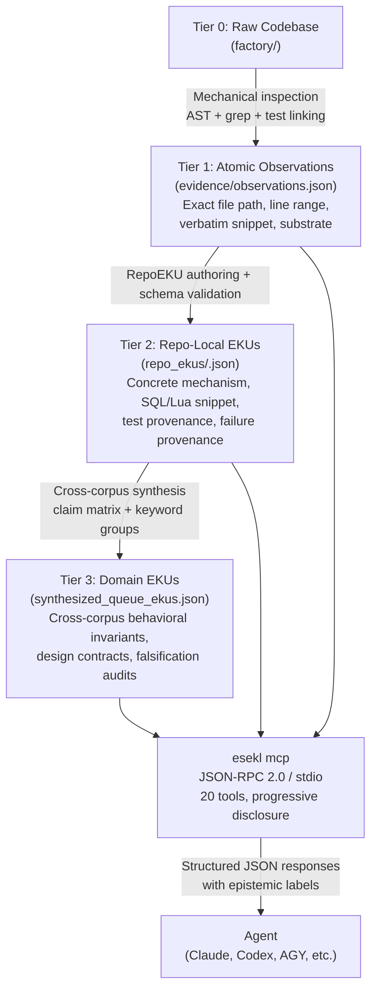

# esekl — ESEKL Model Context Protocol Server

ESEKL (Empirical Software Engineering Knowledge Layer) is an MCP server that gives agents access to provenance-traced empirical evidence from mature open-source distributed systems. It ships exclusively as an MCP server. There is no other supported interface.

Agents designing queue processors, brokers, or streaming pipelines tend to hallucinate behavioral invariants, misattribute failure modes, and produce verification plans without empirical grounding. ESEKL solves this by mechanically inspecting production codebases — extracting SQL queries, Lua scripts, test suites, and regression commits — and serving that material through 20 progressive-disclosure tools that prevent context flooding.

The current corpus covers 13 systems: asynq, bullmq, pgmq, river, goqite, litequeue, nats-server, nsq, blazingmq, redpanda, rabbitmq, artemis, and rocketmq.

---

## How EKUs Are Developed



Source repositories are checked out at pinned commits (tracked in `eku_store/release/factory_repo_lock.json`). Mechanical inspection captures file paths, line ranges, and verbatim snippets as Atomic Observations. These are promoted to Repo-Local EKUs tied to a single repository, then synthesized upward into Domain EKUs that carry cross-corpus invariants with explicit falsification audits. The MCP server reads the static store and enforces progressive disclosure — agents never browse the raw files directly.

The `eku_store/` directory ships **bundled inside this npm package**. No initialization step is required. `npx --package=@esekl/mcp esekl mcp` resolves the store from the package directory automatically.

---

## Installation

No installation step is required.

The `eku_store/` directory is bundled directly inside this package. When `npx --package=@esekl/mcp esekl mcp` starts, the server resolves the store from the package directory — no local copy, no `esekl init`, no per-project setup. The package is ~1.4 MB compressed and cached by npx after the first run.

---

## MCP Configuration

This single JSON block works on every machine, for every project, with no paths and no prior setup:

```json
{
  "mcpServers": {
    "esekl": {
      "command": "npx",
      "args": ["--yes", "--package=@esekl/mcp", "esekl", "mcp"]
    }
  }
}
```

**Store resolution order** (first match wins):

1. `--store-root=<path>` — explicit override, for advanced use.
2. `~/.esekl/store` — if `esekl init` was run for a fully offline or custom corpus.
3. `<package_dir>/eku_store` — **bundled in the package, always available, no setup needed.**

Store updates ship with the package: running `npx --package=@esekl/mcp esekl mcp` against a new package version automatically picks up new EKUs and observations.

### Claude Desktop

Edit `~/.config/claude/claude_desktop_config.json` (macOS: `~/Library/Application Support/Claude/claude_desktop_config.json`) and add the block above. Restart Claude Desktop.

### AGY (Antigravity)

Add the block above to your AGY MCP config file. No restart required for most AGY configurations.

### Codex CLI

Add to `~/.codex/config.toml`:

```toml
[mcp_servers.esekl]
command = "npx"
args = ["--yes", "--package=@esekl/mcp", "esekl", "mcp"]
```

For Codex environments that accept JSON `mcpServers` config, use the JSON block above.

---

## Tool Surface

20 tools across three tiers.

### Discovery and Navigation (6 tools)

| Tool | Input | Output shape |
|---|---|---|
| `get_capabilities` | none | Domain, corpus size, total EKUs/claims/observations, repository list, `repoEkuCoverage` ratios, supported filters. |
| `list_dossiers` | `language?`, `storageEngine?`, `page?`, `pageSize?` | Paginated list: repo name, language, storage engine, architecture style, observation count, failure count, summary. |
| `get_dossier_summary` | `repo` | Key mechanisms, discovered edge conditions, available slice types. |
| `list_research_threads` | none | Named cross-repo failure themes with IDs and linked domain EKU IDs. |
| `get_dossier_slice` | `repo`, `sliceType` | Paginated structured slice. `sliceType`: `architecture`, `state_machine`, `lease_management`, `failure_recovery`, `concurrency_control`. Each item: topic, mechanism, evidence ID, epistemic status. |
| `compare_engines` | `repoA`, `repoB`, `aspect?` | Language, storage, architecture style, claim matrix comparison side-by-side. |

### Evidence and Layered Retrieval (12 tools)

| Tool | Input | Output shape |
|---|---|---|
| `search_evidence` | `query`, `filters?`, `limit?` | Ranked results with ID, type, title, object type, relevance score, summary, epistemic label. Filters: `layer` (`repo_eku`, `keyword_group`, `domain_eku`, `implementation_packet`, `failure_chain`), `repo`, `objectType`. |
| `get_eku` | `ekuId` | Full Domain EKU: behavioral invariant, design contract, verification contract, supporting and counter evidence IDs, corpus stats (`applicable`, `supports`, `counterexamples`). |
| `list_repo_ekus` | `repo?`, `mechanism?`, `objectType?`, `page?`, `pageSize?` | Paginated list of Repo-Local EKUs with mechanism, claim, keywords, and local context. |
| `get_repo_eku` | `repoEkuId` | Full Repo-Local EKU including exact source file path, line range, SQL/Lua snippet, and test function name. |
| `list_keyword_groups` | `keyword?`, `facet?`, `commonOnly?`, `uniqueOnly?`, `page?`, `pageSize?` | Keyword facet groups with participating RepoEKU IDs and linked Domain EKU IDs. `facet` values: `COMMON_KEYWORD`, `UNIQUE_KEYWORD`, `MECHANISM_FAMILY`, `SUBSTRATE_FAMILY`. |
| `get_keyword_group` | `groupId` | Full group with complete local context for all participating RepoEKUs. |
| `trace_domain_eku` | `ekuId` | Common and unique keyword groups, mechanism families, substrate families, supporting RepoEKUs with claims. |
| `get_failure_patterns` | `problemStatement`, `filters?`, `limit?` | Failure patterns with commit hash, failure mechanism, and prevention contract. |
| `get_failure_chains` | `repo?`, `trigger?`, `hasRegressionTest?`, `limit?` | Causal chains: trigger, intermediate invariant breakdown, terminal failure, regression test flag. |
| `get_implementation_evidence` | `ekuId?`, `repo?`, `substrate?`, `mechanism?`, `limit?` | Implementation packets with source snippet, keyword facets, linked claims, test references, and applicability constraints. `substrate` values: `postgres`, `redis`, `sqlite`, `memory`, `file`, `raft`, `amqp`, `native`. |
| `explain_provenance` | `evidenceId` | Full down-trace: file path, line range, commit hash, source URL, raw source URL, snippet SHA-256, test function, associated claim and EKU IDs. |
| `get_data_quality_report` | `layer?`, `limit?` | Store health status, issue count, and diagnostic list with issue codes. `layer` values: `REPO_LOCAL`, `DOMAIN_ABSTRACTION`. |

### Design Critique and Verification (2 tools)

| Tool | Input | Output shape |
|---|---|---|
| `compare_design_against_evidence` | `proposedDesign`, `options?` | Matched EKU IDs, missing invariants with severity and recommended fix, "what not to promise" contracts, epistemic classification counts. |
| `generate_verification_plan` | `requirementOrDesign`, `options?` | Adversarial test suites, each with name, motivating EKU ID, motivating failure ID, and step-by-step procedure. |

---

## Result Shapes

### `get_capabilities`

```json
{
  "domain": "Queue, Broker & Streaming Systems",
  "corpusSize": 13,
  "repositories": ["asynq", "bullmq", "pgmq", "river", "goqite", "litequeue", "nats-server", "nsq", "blazingmq", "redpanda", "rabbitmq", "artemis", "rocketmq"],
  "totalEkus": 20,
  "totalRepoEkus": 15,
  "totalClaims": 20,
  "totalObservations": 30,
  "totalHistoricalFailures": 9,
  "repoEkuCoverage": {
    "repositoriesWithRepoEkus": ["asynq", "bullmq", "pgmq", "river", "litequeue", "nats-server", "redpanda"],
    "repositoriesPendingRepoEkus": ["goqite", "nsq", "blazingmq", "rabbitmq", "artemis", "rocketmq"],
    "coverageRatio": "7/13"
  },
  "version": "5.0.0-consolidated"
}
```

### `get_eku`

```json
{
  "id": "EKU-QUEUE-015",
  "title": "Fenced Domain Result Promotion & Outbox Emission",
  "objectType": "BEHAVIORAL_INVARIANT",
  "claimId": "CLM-015",
  "problem": "A queue can fence stale completion of the job row while still allowing a superseded worker to write authoritative domain results or emit an outbox event.",
  "behavioralInvariant": "Ownership fencing must guard every authoritative side-effecting state mutation, including domain result promotion or outbox emission, not only queue-row completion.",
  "designContract": "Before committing a result row, payment ledger projection, or sendable outbox record, the storage transaction must prove current job ownership by token/generation.",
  "verificationContract": [
    "Worker A owns generation 1 and pauses.",
    "Worker B owns generation 2 and completes.",
    "Worker A attempts domain result promotion and queue completion.",
    "Both stale writes affect zero authoritative rows and emit stale-owner telemetry."
  ],
  "supportingEvidence": ["OBS-BULLMQ-002", "OBS-LITEQUEUE-002"],
  "historicalEvidence": ["HIST-RIVER-003"],
  "corpusStats": {
    "corpusSize": 13,
    "applicable": 7,
    "supports": 2,
    "counterexamples": 3
  }
}
```

### `get_repo_eku`

```json
{
  "repoEku": {
    "id": "REKU-RIVER-001",
    "repository": "river",
    "mechanism": "Relational Lock-Free Dequeue (FOR UPDATE SKIP LOCKED)",
    "claim": "PostgreSQL FOR UPDATE SKIP LOCKED allows concurrent worker pools to acquire non-overlapping available jobs without table-level locking.",
    "localContext": "River implements its primary job queue inside PostgreSQL. It relies on FOR UPDATE SKIP LOCKED in its sqlc query to scale Go worker goroutines.",
    "sourceProvenance": {
      "filePath": "riverdriver/riverpgxv5/internal/dbsqlc/river_job.sql",
      "lineRange": [45, 55],
      "queryOrCodeSnippet": "SELECT id, args, attempt, state FROM river_job WHERE state = 'available' ORDER BY priority ASC, scheduled_at ASC LIMIT $1 FOR UPDATE SKIP LOCKED;"
    },
    "testProvenance": {
      "filePath": "internal/jobexecutor/job_executor_test.go",
      "testName": "TestJobExecutor"
    },
    "epistemicStatus": "REPO_LOCAL"
  }
}
```

### `explain_provenance`

```json
{
  "evidenceId": "OBS-BULLMQ-002",
  "type": "OBSERVATION",
  "repository": "taskforcesh/bullmq",
  "commitHash": "c06b51cd3aacd0d9ee65e2544220c89f24d2479c",
  "filePath": "src/commands/moveToFinished-12.lua",
  "lineRange": { "start": 40, "end": 44 },
  "sourceUrl": "https://github.com/taskforcesh/bullmq/blob/c06b51cd3aacd0d9ee65e2544220c89f24d2479c/src/commands/moveToFinished-12.lua#L40-L44",
  "snippetSha256": "4b68e98da6984e1b00ad99e74d1c448bb5bbcb110cb16246473133604f32616f",
  "epistemicStatus": "SOURCE_OBSERVED"
}
```

### `compare_design_against_evidence`

```json
{
  "matchingEkus": ["EKU-QUEUE-015", "EKU-QUEUE-016", "EKU-QUEUE-017"],
  "missingInvariants": [
    {
      "invariant": "Storage-Time Lease Evaluation",
      "severity": "CRITICAL",
      "risk": "Caller-supplied VM timestamps allow clock drift across container hosts to cause premature lease expiration or duplicate execution.",
      "recommendedFix": "Use database server time (e.g. clock_timestamp()) exclusively in lease recovery queries."
    }
  ],
  "whatNotToPromise": [
    "Never promise true exactly-once delivery over external network boundaries without partner idempotency keys.",
    "Never promise constant latency during unmetered enterprise batch spikes; enforce admission semaphores and HTTP 429/503."
  ],
  "epistemicClassification": {
    "empiricalEvidenceCount": 8,
    "modelInferredPoints": 2
  }
}
```

### `generate_verification_plan`

```json
{
  "testSuites": [
    {
      "name": "Split-Brain Worker Generation Fencing Test",
      "motivatedByEku": "EKU-QUEUE-015",
      "motivatedByFailure": "HIST-RIVER-003",
      "procedure": [
        "Worker A acquires generation 1 lease and executes external API.",
        "Inject 45s pause into Worker A.",
        "Rescuer assigns generation 2 to Worker B; Worker B completes and commits.",
        "Worker A resumes and attempts commit with generation 1.",
        "Assert Worker A write affects 0 rows and emits stale_worker_write error."
      ]
    }
  ]
}
```

---

## Roadmap: Domain Expansion

The current package bundles the queue and broker corpus. As new domains are researched, the corpus splits into independently versioned scoped packages under the `@esekl/` org:

```
@esekl/mcp               Core MCP server — always installed, always the entry point
@esekl/store-queues      Queue and broker corpus (asynq, bullmq, pgmq, river, nats, ...)  ← current
@esekl/store-databases   Database internals corpus (postgres, sqlite, redis internals, ...)
@esekl/store-networking  Networking and protocol corpus (gRPC, HTTP/2, QUIC, ...)
@esekl/store-all         Meta-package: installs all domain stores
```

**MCP config never changes.** The single JSON block works regardless of which domain stores are installed:

```json
{
  "mcpServers": {
    "esekl": {
      "command": "npx",
      "args": ["--yes", "--package=@esekl/mcp", "esekl", "mcp"]
    }
  }
}
```

**Opting into a domain** (when additional stores ship):

```bash
npm install @esekl/store-databases
# MCP server discovers and loads it automatically on next start — no config change.
```

**Why scoped packages instead of a CLI-download model:**
The store is read-only versioned data, not source code you own. npm is the right distribution primitive: reproducible installs, per-domain changelogs, and automatic caching via `npx`. Domain updates ship as npm version bumps; the MCP server picks them up without any re-configuration.

---

## Epistemic Labels

Every tool response carries an epistemic label on each result item.

| Label | Meaning |
|---|---|
| `SOURCE_OBSERVED` | Direct mechanical inspection of production source files. |
| `TEST_OBSERVED` | Direct inspection of regression test suites in the target repository. |
| `HISTORY_SUPPORTED` | Verified real-world production incident or bugfix commit. |
| `DOCUMENTED` | Architecture documentation or official specification statement. |
| `MODEL_INFERRED` | High-level synthesis formulated across observations. |
| `CROSS_REPO_ABSTRACTION` | Universal behavioral property validated across two or more codebases. |
| `SYNTHESIZED_ADVICE` | Actionable architectural guidance derived from empirical invariants. |

---

## Error Handling

Unknown identifiers return a structured error:

```json
{
  "error": "NOT_FOUND",
  "message": "Unknown identifier 'EKU-QUEUE-999'",
  "availableIds": ["EKU-QUEUE-001", "EKU-QUEUE-002", "..."]
}
```

All paged tools enforce default limits (`pageSize: 10`, `limit: 5`) to prevent accidental context flooding. Tools never expose hidden benchmark rubric keys or evaluation test answers.

---

## Telemetry

`@esekl/mcp` collects anonymous usage events via [PostHog](https://posthog.com) to understand which tools agents use and how the server is adopted across platforms. No personal data, no query content, no file paths are ever recorded.

### What is collected

| Event | When | Properties |
|---|---|---|
| `mcp_start` | Server process starts | `version`, `platform`, `node_version` |
| `tool_call` | Any of the 20 tools is invoked | `tool_name`, `status` (`ok` / `error`), `version`, `platform`, `node_version` |

`distinct_id` is always `anonymous` — no user ID, no machine ID, no persistent identifier of any kind.

### What is never collected

- Query text, proposed designs, or any argument values passed to tools
- Tool response content
- File paths or project structure
- IP addresses (PostHog anonymization is enabled)

### Opting out

Set `ESEKL_NO_TELEMETRY=1` in your environment. The server starts and operates identically — the only difference is no HTTP request is made to PostHog.

**Shell / global:**
```bash
export ESEKL_NO_TELEMETRY=1
```

**Per-session in your MCP config** (Claude Desktop / AGY):
```json
{
  "mcpServers": {
    "esekl": {
      "command": "npx",
      "args": ["--yes", "--package=@esekl/mcp", "esekl", "mcp"],
      "env": { "ESEKL_NO_TELEMETRY": "1" }
    }
  }
}
```

**Codex `config.toml`:**
```toml
[mcp_servers.esekl]
command = "npx"
args = ["--yes", "--package=@esekl/mcp", "esekl", "mcp"]
env = { ESEKL_NO_TELEMETRY = "1" }
```

---

## Full MCP Contract

Complete input schemas, output schemas, and error contracts for all 20 tools: [`mcp_contract.md`](./mcp_contract.md)

---

## Layer Query Scenarios

These five scenarios cover the full retrieval and critique surface of the ESEKL MCP server.

### Scenario A: Investigating a Repo-Specific Mechanism

Use `list_repo_ekus` filtered by `repo` to surface concrete, evidence-bearing Repo-Local EKUs for a specific codebase. Follow with `get_repo_eku` for full source provenance and SQL/Lua snippets.

```
list_repo_ekus({ "repo": "river" })
→ get_repo_eku({ "repoEkuId": "REKU-RIVER-001" })
```

### Scenario B: Exploring Cross-Cutting Keyword & Substrate Facets

Use `list_keyword_groups` to find which repositories share a common mechanism keyword, then `get_keyword_group` for the full set of participating Repo-Local and Domain EKUs.

```
list_keyword_groups({ "keyword": "skip_locked" })
→ get_keyword_group({ "groupId": "skip_locked" })
```

### Scenario C: Down-Tracing a Domain Invariant to Ground-Truth Evidence

Use `trace_domain_eku` to down-trace a Domain EKU to its supporting Repo-Local EKUs, alternative mechanisms, and counterexamples. Use `explain_provenance` to retrieve exact source file lines and snippet SHA-256.

```
trace_domain_eku({ "ekuId": "EKU-QUEUE-007" })
→ explain_provenance({ "evidenceId": "OBS-RIVER-001" })
```

### Scenario D: Querying Concrete Implementation Evidence Packets

Use `get_implementation_evidence` filtered by domain EKU and substrate to surface bounded implementation packets with source snippets, test references, and keyword facets.

```
get_implementation_evidence({ "ekuId": "EKU-QUEUE-001", "substrate": "postgres" })
```

### Scenario E: Evidence-Constrained Architectural Critique & Adversarial Verification

Use `compare_design_against_evidence` to audit a proposed architecture against empirical invariants, then `generate_verification_plan` to produce adversarial test suites mapped to specific EKUs and historical failure commits.

```
compare_design_against_evidence({ "proposedDesign": "..." })
→ generate_verification_plan({ "requirementOrDesign": "..." })
```
